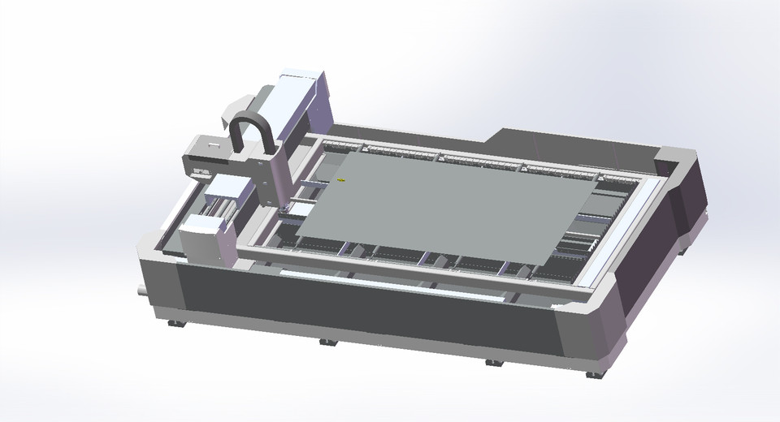
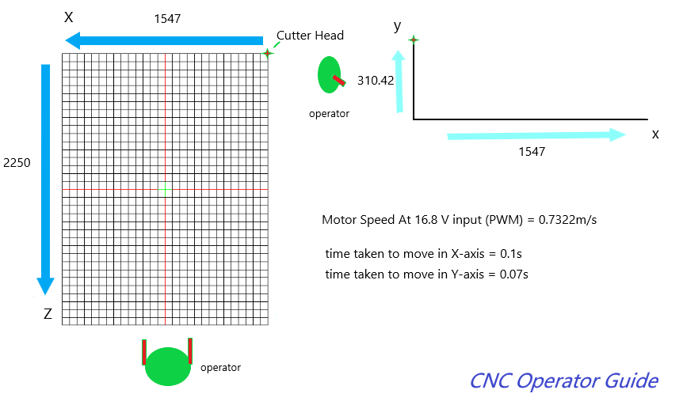

# Mechatronics II CNC Project

# The Controller

## Hardware Requirements:

- Raspberry Pi 3 Model B (4x USB ports, Bluetooth/WiFi support, 40 IO{Input Output} pins)
- 5V 1000mA+ mini usb power supply
- 16 GB micro SD card
- Male-to-Female jumper wires
- L298n H-Bridge 

## Software Requirements:

- Raspberry Pi OS NOOBS installation option ~ http://downloads.raspberrypi.org/NOOBS_latest (2GB file size)
- SD Formatter ~ https://www.sdcard.org/downloads/formatter_4
- Python3 ~ https://www.python.org/downloads/release/python-374/ OR bootup into the Pi's OS connect to your wifi and hit ctrl + alt + t to open the linux terminal:
    - type sudo apt-get install python
    - then sudo apt-get install python-RPi.GPIO

## Operators Guide:

